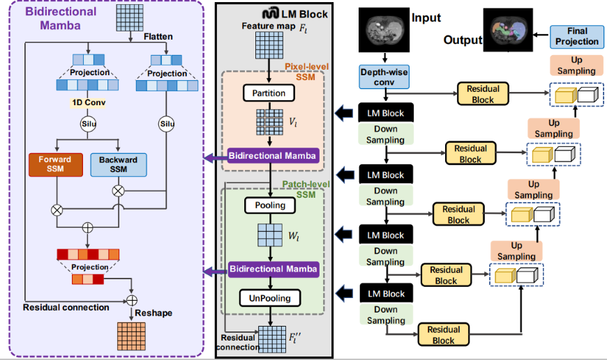

# LMa-UNet: First large kernel Mamba model for medical segmentation elevates SSMs beyond Convolution and Self-attention 🚀




<div align="center">

[](https://arxiv.org/abs/2403.07332)
</div>

<p align="center" style="font-size: larger;">
  <a href="https://arxiv.org/abs/2403.07332">Large Window-based Mamba UNet for Medical Image Segmentation: Beyond Convolution and Self-attention</a>
</p>

--- 

### Requirements: 

python 3.10 + torch 2.0.1 + torchvision 0.15.2 (cuda 11.8)

If cuda is 11.8 run:
```bash
pip install torch==2.0.1+cu118 torchvision==0.15.2+cu118 -f https://download.pytorch.org/whl/torch_stable.html
```

Install [Mamba](https://github.com/state-spaces/mamba): `pip install causal-conv1d==1.1.1` and `pip install mamba-ssm`

Install [monai](https://github.com/Project-MONAI/MONAI): `pip install monai` 

Download code: `git clone https://github.com/wjh892521292/LMa-UNet` and `cd LMa-UNet/lmaunet` and run `pip install -e .`


### Preprocessing

```bash
nnUNetv2_plan_and_preprocess -d DATASET_ID --verify_dataset_integrity
```

### Train models

- Train 2D `LMaUNet` model

```bash
nnUNetv2_train DATASET_ID 2d all -tr nnUNetTrainerLMaUNet
```


- Train 3D `LMaUNet` model

```bash
nnUNetv2_train DATASET_ID 3d_fullres all -tr nnUNetTrainerLMaUNet
```


## Inference

- Predict testing cases with `LMaUNet` model

```bash
nnUNetv2_predict -i INPUT_FOLDER -o OUTPUT_FOLDER -d DATASET_ID -c CONFIGURATION -f 'all' -tr nnUNetTrainerLMaUNet --disable_tta -npp 1
```

> `CONFIGURATION` can be `2d` and `3d_fullres` for 2D and 3D models, respectively.

## Paper

```
@article{wang2024large,
    title={Large Window-based Mamba UNet for Medical Image Segmentation: Beyond Convolution and Self-attention},
    author={Jinhong Wang and Jintai Chen and Danny Chen and Jian Wu},
    journal={arXiv preprint arXiv:2403.07332},
    year={2024}
}
```


## Acknowledgements

Thank the authors of [nnU-Net](https://github.com/MIC-DKFZ/nnUNet), [Mamba](https://github.com/state-spaces/mamba) and [U-mamba](https://github.com/bowang-lab/U-Mamba) for making their valuable code publicly available.
